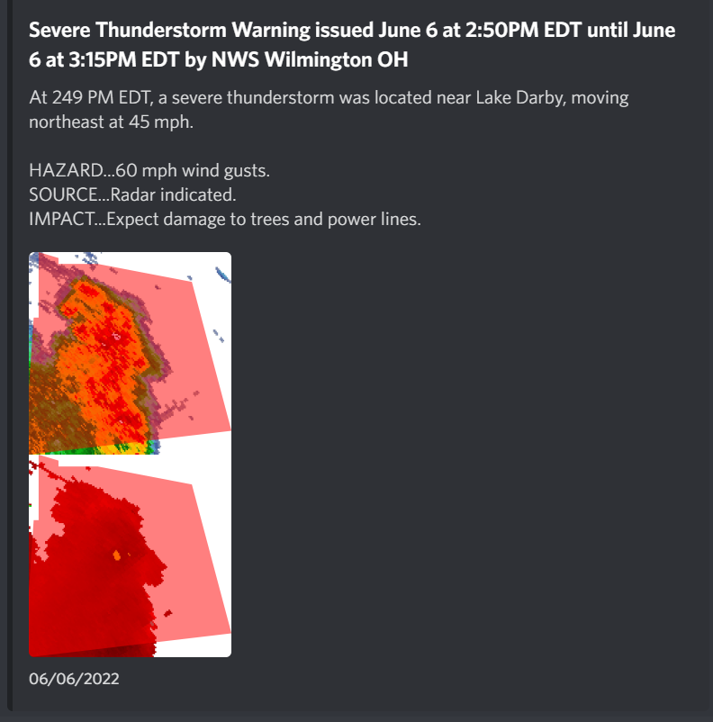

## NWS Alert
This application monitors the National Weather Service's API for any alerts impacting a specified location. When a new alert appears - a Discord message is sent including details of the alert. If the alert contains a warning polygon, reflectivity and velocity information from radar will be included in an attached image as seen below:

